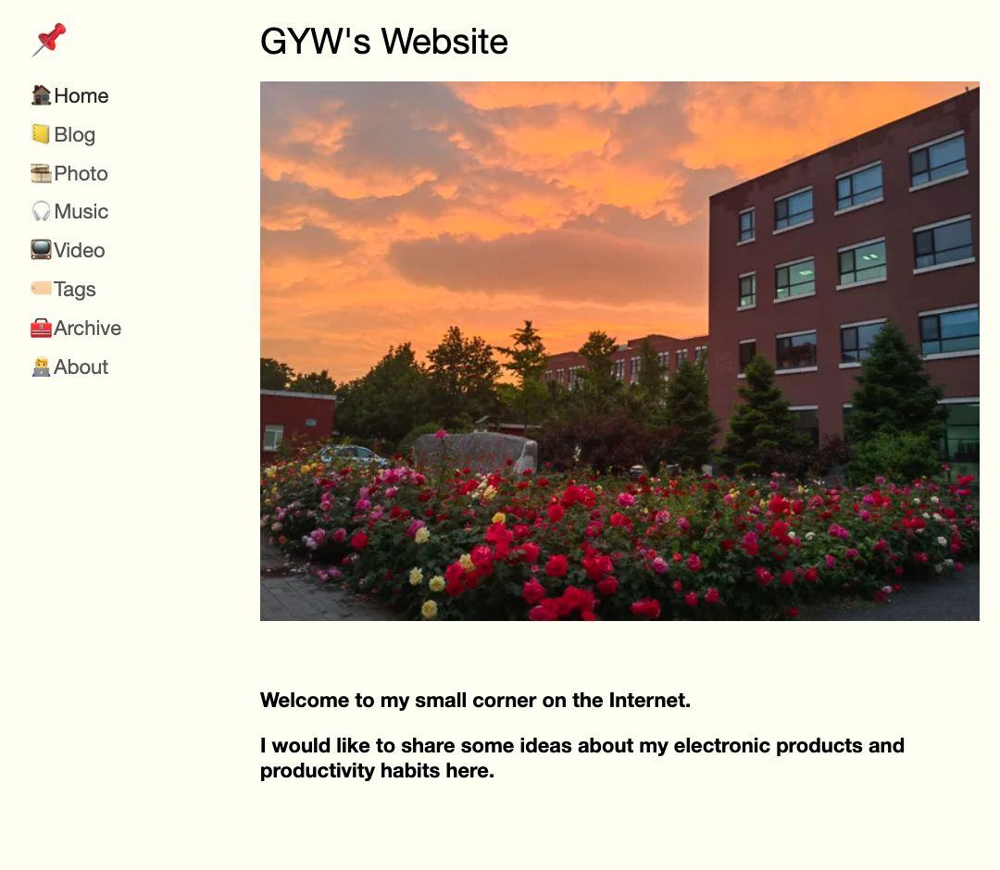
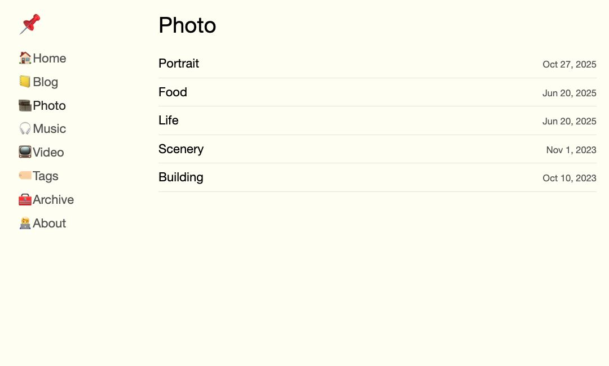

<p align="center">
  <a href="./README.md">简体中文</a> · <strong>English</strong>
</p>

# Moire Blog

Turn Apple Notes into a static website that you fully control.

The Mac only exports public notes, GitHub versions them, and Cloudflare handles
parsing, building, and deployment. The site borrows the folder-as-section model
and calm reading experience of [Montaigne](https://docs.montaigne.io/), without
depending on a Montaigne account or server.

<p align="center">
  <a href="https://moireblog.guoyingwei.top"><strong>Live site</strong></a>
  ·
  <a href="#quick-start"><strong>Quick start</strong></a>
  ·
  <a href="#documentation"><strong>Documentation</strong></a>
</p>

## Preview

<p align="center">
  
</p>
<p align="center"><sub>Home page and sidebar navigation</sub></p>

<p align="center">
  
</p>
<p align="center"><sub>A section and title list generated from an Apple Notes folder</sub></p>

## Why this project exists

- **Apple Notes remains the editor:** write on iPhone or Mac and attach images,
  recordings, and PDFs.
- **Self-hosted publishing:** public content only passes through your Mac,
  GitHub repository, and Cloudflare project.
- **A lightweight Mac role:** the Mac exports one raw snapshot; it does not
  render or build the website.
- **Notes structure is preserved:** folders, titles, tables, lists, mono text,
  tags, and attachments can all reach the site.
- **Static delivery is fast:** visitors read static HTML from Cloudflare's edge;
  the site never queries Notes at request time.
- **Configuration is auditable:** content, settings, and publishing events have
  Git history and can be reviewed or restored.

## How it works

```text
Apple Notes on iPhone / Mac
              ↓ iCloud
       read-only macOS exporter
              ↓
 notes-export/public-notes.json
              ↓ git push
       GitHub blog branch
              ↓ automatic build
         Cloudflare Pages
              ↓
   HTML / RSS / Sitemap / media
```

| Stage | Responsible for | Not responsible for |
| --- | --- | --- |
| macOS | Reading one public Notes tree, creating the raw snapshot, and pushing changes | Markdown conversion, image optimization, site builds |
| GitHub | Versioning the snapshot, code, configuration, and publication history | Reading Apple Notes directly |
| Cloudflare | Remote parsing, responsive media, SvelteKit static builds, and edge delivery | Modifying Apple Notes |

Once a snapshot reaches GitHub, turning off or sleeping the Mac does not affect
the already deployed site.

## Quick start

### 1. Clone and switch to `blog`

```sh
git clone https://github.com/guoyingwei6/moire.git
cd moire
git checkout blog
```

You need macOS, Notes.app, Git, Node.js, and pnpm. Fork users should replace the
repository URL with their own.

### 2. Prepare Apple Notes

Create one parent folder that contains public content only:

```text
your.public.notes.folder
├── index
├── Blog
├── Photo
├── Music
├── Video
└── About
```

The root must contain a note named `index`. Its body becomes the home page, and
its menu table controls both navigation and the direct child folders that may be
exported:

```markdown
| menu | url | type |
| --- | --- | --- |
| 🏠Home | / | sidebar |
| 📒Blog | /blog | sidebar |
| 🎞️Photo | /photo | sidebar |
| 🎧Music | /music | sidebar |
| 📺Video | /video | sidebar |
| 🏷️Tags | /tags | sidebar |
| 🧰Archive | /archive | sidebar |
| 🧑‍💻About | /about/about-me | sidebar |
```

Adding an ordinary note to an authorized section requires no further
configuration. A title beginning with `_` is a lightweight draft and stays out
of sections, Tags, Archive, RSS, and Sitemap.

### 3. Configure Mac sync once

```sh
node scripts/notes/setup-macos-sync.mjs --root "your.public.notes.folder"
```

The script installs dependencies, triggers the Notes automation permission,
installs a per-user LaunchAgent, and prints its status. It runs at login and
every ten minutes by default; unchanged snapshots create no empty commits.

Verify locally:

```sh
pnpm notes:publish
pnpm notes:agent:status
```

After checking the snapshot, push once:

```sh
pnpm notes:publish:push
```

### 4. Connect Cloudflare Pages

Create a Pages project with:

```text
Production branch: blog
Build command: pnpm build
Build output directory: build
Root directory: repository root
```

To use the online settings page, also configure two server-only secrets:

```text
GITHUB_TOKEN
SETTINGS_PASSWORD
```

Use a fine-grained `GITHUB_TOKEN` limited to Contents read/write for this
repository. Never put the token or password in the repository, frontend code,
or a URL. See [Cloudflare Pages deployment](./docs/cloudflare-pages.md) for the
full deployment reference.

## Core features

| Capability | Current implementation |
| --- | --- |
| Content structure | One public parent folder; root `index` controls the home page, navigation, and publication scope; direct child folders become sections |
| Pages | Section lists, stable note URLs, Tags, Archive, Search, RSS, Sitemap, and 404 |
| Rich text | Headings, tables, nested lists, inline mono text, code blocks, and basic shell highlighting |
| Images | Multiple images, source layout, side-by-side images, responsive WebP, preserved originals, lightbox, keyboard and swipe navigation |
| Attachments | Embedded PDF preview, audio player, video player, and generic file cards |
| Native tags | Reads real Apple Notes tags from the Notes database and builds the Tags page |
| Link previews | Whitelisted YouTube, Apple Music, Spotify, Apple Podcasts/TV, maps, Bilibili, Xiaohongshu, GitHub, DOI, and related embeds |
| Page options | Root, folder, and individual-note `name/value` tables with inheritance and overrides |
| Note password lock | Per-note `password` / `密码`, or `locked` plus build-time `MOIRE_NOTES_PASSWORD`; AES-256-GCM at build, browser unlock; still listed, excluded from search/RSS/Sitemap |
| Accent hover UI | Sidebar, current section, titles, list titles, and footer links use the site accent (`--accent` / `/settings/` link color) on hover |
| Site settings | Password-protected `/settings/` for identity, colors, social links, and display switches |
| Publishing safety | Safe local paths only; non-`blog` branches refuse publishing; the settings API can only write `site.config.json` |

The project intentionally does not generate generic previews for arbitrary
URLs. A new preview type requires an explicit allowlist rule, avoiding unknown
page fetches during local export or remote builds.

## Where configuration lives

| Source | Best used for |
| --- | --- |
| `/settings/` / `site.config.json` | Site title, author, domain, colors, social links, and default display switches |
| Root `index` | Home content, Sidebar/Header/Footer navigation, and public-section allowlist |
| Folder `index` `name/value` table | Section layout, ordering, child visibility, and section defaults |
| Ordinary note `name/value` table | Note date, slug, aliases, navigation, metadata, display overrides, and per-note password lock (`password` / `密码` / `locked`) |
| Note body | Article content, images, tags, links, and attachments |

Page options inherit in this order:

```text
ordinary note > folder index > root index > site.config.json defaults
```

Site identity, colors, and social information are owned only by `/settings/` /
`site.config.json`, so the next Notes sync cannot overwrite them. See
[Apple Notes configuration](./docs/configuration.md) for the full field
reference.

## Daily publishing

Normal use happens entirely in Apple Notes:

1. iCloud syncs the change to the Mac.
2. `launchd` runs the exporter on its next interval.
3. If the snapshot changed, the publisher commits and pushes `origin/blog`.
4. Cloudflare builds and publishes the new version.

Useful commands:

```sh
pnpm notes:publish          # commit a changed snapshot locally
pnpm notes:publish:push     # commit and push when changed
pnpm notes:agent:status     # inspect automatic sync
pnpm notes:agent:restart    # reload the LaunchAgent
pnpm notes:agent:uninstall  # stop automatic sync
pnpm test                   # content and security tests
pnpm check                  # Svelte / TypeScript checks
pnpm build                  # complete static build
pnpm test:build             # validate generated output
```

The LaunchAgent is not a permanently running Node daemon. Each run exits, and
macOS `launchd` starts a new run at the next interval. Failed runs are retried on
the following interval.

## Performance design

The site feels fast because the whole delivery path is static-first, not merely
because it uses SvelteKit:

- every public route is prerendered to static HTML at build time;
- Cloudflare Pages serves pages and media from edge locations;
- internal links use client-side navigation and preload destinations on hover;
- each page carries only its own data instead of the entire notes library;
- responsive WebP images are generated remotely and use lazy loading plus
  asynchronous decoding;
- content-hashed CSS, JavaScript, and derived media use one-year `immutable`
  caching;
- previous/next, Tags, and Archive data are computed once and reused;
- responsive images are built incrementally by source hash and can be restored
  across deployments through Cloudflare Build Cache.

Opening an already deployed article remains a static-file request even as the
library grows. Remote build time is the metric to watch. Section pagination or
a chunked Pagefind index should be added only when real scale requires them,
instead of increasing complexity preemptively.

## Documentation

The README is the project home, first deployment guide, and daily entry point.
Detailed material is separated by task:

| Document | Read it when |
| --- | --- |
| [Apple Notes → GitHub sync](./docs/apple-notes-github-sync.md) | Understanding the exporter, snapshot, LaunchAgent, logs, and migration |
| [Content and configuration](./docs/configuration.md) | Configuring root `index`, sections, note metadata, slugs, aliases, and drafts |
| [Cloudflare Pages deployment](./docs/cloudflare-pages.md) | Configuring builds, secrets, caching, custom domains, and online settings |
| [Publish manifest and reconciliation](./docs/publish-manifest.md) | Debugging deletion, renaming, moving, and generated-file ownership |
| [Montaigne feature parity](./docs/montaigne-parity.md) | Reviewing design sources, compatibility, and historical tradeoffs |

`docs/montaigne-parity.md` is a design comparison and historical record, not
the current installation entry point.

## Branches

| Branch | Purpose | Deployment |
| --- | --- | --- |
| `main` | Stays close to the original/upstream Moire line | <https://moire.guoyingwei.top> |
| `development` | Minimal title-list line; content is synchronized from `main` | <https://moires.guoyingwei.top> |
| `blog` | The macOS Apple Notes folder blog documented here | <https://moireblog.guoyingwei.top> |

The three deployments are isolated and do not overwrite one another. The local
Notes publisher only permits writes to `blog`.

## Current boundaries

- only direct child folders of the public parent folder become sections;
- a new public section needs one row in the root `index` menu;
- automation uses a scheduled LaunchAgent, not a real Notes database event hook;
- deletion, renaming, and moving produce reconciliation reports, while
  repository-level automatic cleanup remains deliberately conservative;
- with large libraries, static page delivery remains fast, but pagination or a
  split search index should be chosen from measured build times.

## License

GPL-3.0.
